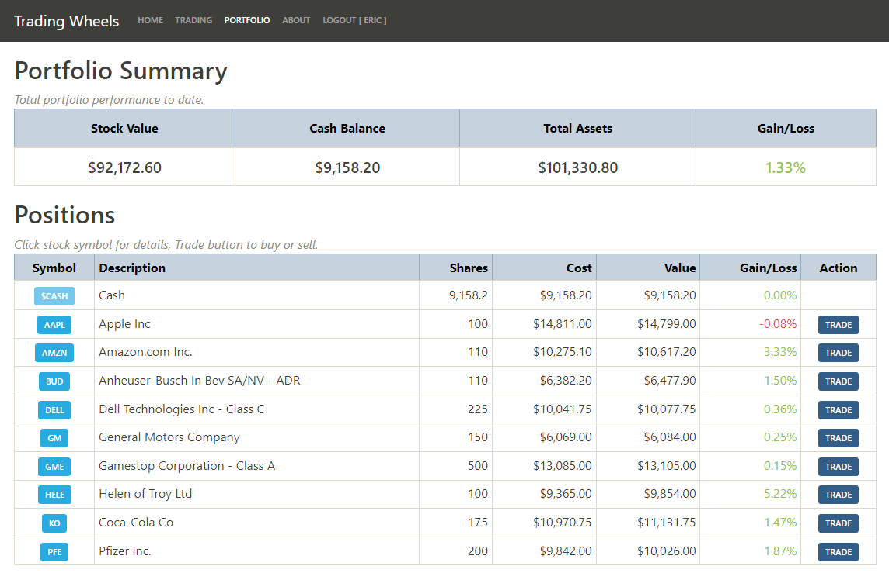

# Trading Wheels

Trading Wheels is a stock trading simulation app. The user starts with $100k of virtual money with which to buy and sell individual stocks.

Once logged in, the user can access the Trading page to search for and trade stocks, and the Portfolio page, to see a list of the user's holding and gains/losses.

### Try Trading Wheels [here](https://et-trading.herokuapp.com/)!

## Installation instructions

Follow the steps below to run your own local copy of [Trading Wheels](https://et-trading.herokuapp.com/).

1. Clone the [trading-wheels](https://github.com/et-codes/trading-wheels) repository into a local project directory.
1. Let's start by setting up the back end first:
   1. Change the working directory to `back-end`.
   1. Install the `poetry` dependency management tool. ([Link](https://python-poetry.org/docs/#installation))
   1. Run `poetry shell`.
   1. Run `poetry install`.
   1. Set environment variable `SECRET_KEY` to any string you want.
   1. Install [PostgreSQL](https://www.postgresql.org/download/) and create a new database.
   1. Set environment variable `SQLALCHEMY_DATABASE_URI` to the `postgresql://` connection string for your database.
   1. Set environment variable `IEX_TOKEN` with your [IEX Cloud](https://iexcloud.io/) API token.
   1. Set environment variable `FLASK_APP` to `trading_wheels.py`.
   1. Run `flask db init` to set up the database migration tool.
   1. Run `flask db migrate` to analyze the schema in the models.
   1. Run `flask db upgrade` to create the database tables and relationships.
1. Now for the front end:
   1. Change the working directory to the project root folder.
   1. Run `npm run build`.
1. Run `flask run` from the Poetry shell in the `back-end` directory.
1. Navigate to `http://localhost:5000` and enjoy!

## Technical information

**Server details**

- The backend code is written in Python.
- The client bundle and API endpoints are served with the Flask framework.
- The interface with the PostgreSQL database is implemented with `Flask-SQLAlchemy`.
- `Flask-Migrations` is used for building and updating the database tables based on the declarative models.
- Login persistence is managed with sessions via the `Flask-Login` module.

**Client details**

- The frontend code is written in JavaScript using the React framework.
- HTTP requests to the API are done using the `axios` library.
- `Bootstrap` and `React-Bootstrap` are used for styling.
- `react-google-charts` is used to create the stock charts.

**Future enhancements**

- Add portfolio performance charting.

## Author

Eric Thornton | [LinkedIn](https://www.linkedin.com/in/ethornton/) | [Twitter](https://twitter.com/eric__thornton)
